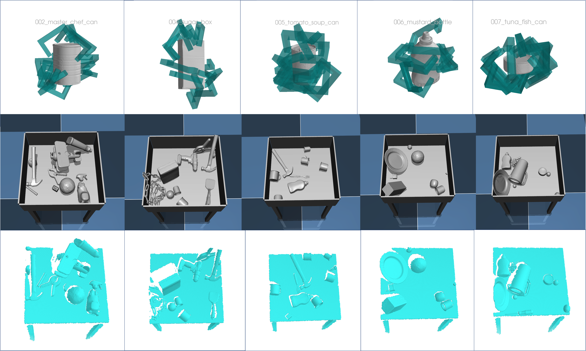

# Simulate  Grasp Dataset Generation （未完成版）

本代码实现的主要功能是：

1. 针对指定夹爪，对YCB数据集中的mesh模型进行Antipodal抓取采样

2. 从YCB数据集中随机抽取指定数量的mesh模型，进行Mujoco物理仿真，获取各个物体的虚拟姿态

   


## 数据集结构

本代码生成的数据集文件夹为`~/dataset/simulate_grasp_dataset/`，该文件夹下面的结构如下：

```bash
.
├── panda  #针对某个特定夹爪(panda)生成的数据集，每种夹爪都将会有自己的文件夹，以下以panda夹爪为例
│   ├── antipodal_grasps#针对panda夹爪尺寸参数，对google_512k中的所有模型都进行Antipodal采样
│   │   └── Readme.txt
│   ├── gripper_params#panda 夹爪的尺寸参数
│   ├── good_meshes.pickle#对于panda夹爪，具有足够多优质抓取的mesh集合
│   └── scenes#虚拟的
│       ├── 0#存放第0帧场景相关文件的文件夹，
│       ├── 1
│       └── ...
└── ycb #存放仿真以及抓取采样需要的模型文件
    ├── all_16k_meshes#运行copy_all_meshes.py 脚本，将google_16k中的所有stl文件拷贝到该文件夹，将会作为模型库供mujoco仿真
    │   ├── 002_master_chef_can.stl#google_16k中的模型文件
    │   ├──...
    │   ├── bg_funnel_part.stl#mujoco世界背景模型文件
    │   └── ...
    ├── google_16k#将google_16k文件解压拷贝到这里，其中的stl文件将会被拷贝到all_16k_stls
    │   ├── 002_master_chef_can
    │   └── ...
    └── google_512k#将google_512k文件解压拷贝到这里，用于Antipodal抓取采样
        ├── 002_master_chef_can_google_512k
        └── ...


```


## 安装

1. 安装修改后的dex-net

2. 安装mujoco

3. 安装blensor虚拟点云生成工具

4. 克隆本仓库代码到任意路径下

   ```bash
   git clone https://github.com/Hymwgk/simulate_dataset_generation.git
   ```

   

## 使用 

由于每种夹爪的尺寸是不同的，因此每种夹爪都需要生成特定的数据集，以下的教程以panda夹爪为例;

除了特别标注之外，其余默认使用python3

1. 创建`~/dataset/simulate_grasp_dataset/`文件夹，并创建

   考虑，设置一个dataset_init.py脚本，来自动创建指定结构的目录

2. 下载[ycb数据集](http://ycb-benchmarks.s3-website-us-east-1.amazonaws.com/)中的google_512k以及google_16k两种分辨率的文件，之后将两个文件夹手动拷贝到`~/dataset/simulate_grasp_dataset/ycb/`路径下

   ```bash
   python  ycb_download.py   #python2
   ```

3. 由于mujoco的场景xml文件，要求一个场景中所有的mesh文件都处于同一个文件夹中，所以为了方便mujoco读取模型，需要将仿真需要的16k分辨率文件拷贝到一个统一的`~/dataset/simulate_grasp_dataset/ycb/all_16k_meshes/`文件夹中

   ```bash
   python  copy_all_meshes.py 
   ```

4. 将下载的桌子等背景文件拷贝到`all_16k_meshes`文件夹中

   
   
5. 为`~/dataset/simulate_grasp_dataset/ycb/google_512k/`文件夹下的模型生成sdf文件

   ```bash
   python  read_file_sdf.py
   ```

6. 为panda夹爪采样生成抓取，抓取结果将会被自动存放在`~/dataset/simulate_grasp_dataset/panda/antipodal_grasps/`路径下，此步骤执行时间较长

   有两个py脚本，两种采样方法都是Antipodal，但是并行计算结构不同：

   - `sample_grasps_for_meshes.py`  单次只对一个物体进行并行多进程采样(优先使用该方法)  **（把要修改的参数暴露出来，并解释说明，还未完善）**

     `--gripper` 指定夹爪的型号

     `--mode`   指定代码运行模式：

     - `b` 断点采样模式，将会生成`original_<object_name>.pickle`形式的未经过处理的抓取采样文件，会自动跳过已经生成的文件，支持断点运行
     - `r`  重新采样模式，将会忽略已经生成的文件，重新开始采样生成`original_<object_name>.pickle`
     - `p` 处理模式，对已经生成好的`original_<object_name>.pickle`文件作进一步的处理，初步筛选出较为优质的抓取

     `--rounds` 设定每个mesh模型采样几轮

     `--process_n` 设定每一轮采样使用多少个进程并行采样

     `--grasp_n` 设定每一个进程的采样目标是多少个抓取 

     以上的几个参数可以根据自己的电脑配置来选择，其中每个mesh模型总的目标采样数量的计算方式是：
     $$
     target = rounds*process\_n*grasp\_n
     $$

     ```bash
     python sample_grasps_for_meshes.py  --gripper  panda --mode b  --rounds 1 --process_n 60  --grasp_n 200
     ```

   - `generate-dataset-canny.py`  旧版本的采样方法，同时对多个物体采样，每个物体只分配一个进程

     ```bash
     python  generate-dataset-canny.py    --gripper panda   #夹爪名称
     ```

7. 以交互界面形式查看已经采样出的抓取姿态

   ```bash
   python  read_grasps_from_file.py  --gripper panda
   ```

   

8. 由于夹爪尺寸限制，有些模型采样得到的抓取较少，需要根据模型抓取采样结果的好坏多少，筛选出适合该特定夹爪的模型子集合用于场景仿真，它会在`~/dataset/simulate_grasp_dataset/panda/`文件夹下生成名为`good_meshes.pickle`的文件    **还未完善，需要等到上面的抓取生成后才行**

   可以考虑：并不一定非要每种物体只有一个，可以把一些物体，重复几次

   ```bash
   python  check_good_meshes_for_gripper.py  --gripper   panda #夹爪名称
   ```

9. 从上一步筛选的合法模型子集中，随机抽取指定数量的模型，为Mujoco生成指定数量的模拟场景xml配置文件

   `--mesh_num` 每个模拟场景中包含的模型数量

   `--scene_num` 设定一共生成几个虚拟场景

   ```bash
   python  generate_mujoco_xml.py  --gripper panda   --mesh_num  10   --scene_num  100   #夹爪名称    每个场景中包含10个物体    生成100个场景
   ```

10. 读取各个场景的xml配置文件，利用Mujoco进行仿真，生成两类数据：1)筛选出自由落体稳定后仍然存在于桌面上的物体列表（包括背景桌子）；2)对应模型在空间中的位置姿态列表(平移向量+四元数) ；这两类数据共同以`table_meshes_with_pose.pickle`的形式保存在各自的场景文件夹中，该文件将为后续使用BlenSor进行点云仿真提供 场景模型(.obj格式)的路径和对应姿态。

   这一个步骤有一定的概率失败，并且最好是多进程共同仿真，**不过还未完善**

   ```bash
   python  poses_simulation.py   --gripper  panda   #夹爪名称
   ```

11. 多进程渲染目标场景，这一步骤的夹爪需要在代码中改动，因为有个外部参数 `-P` 很麻烦；**后续可以尝试优化下**

    默认选定同时渲染10个模拟场景的点云

    ```bash
    ~/.blensor/./blender  -P   ~/code/simulate_dataset_generation/raw_pc_generate.py    
    ```

12. 查看刚刚渲染出的仿真场景点云   **（尝试包装一下，允许外部引用）**

    `--gripper`  指定夹爪名称，默认panda

    `--show`     直接选择单独查看哪个场景，是文件夹的编号（非0），如果空白则从第0帧开始播放，直到所有点云播放完毕

    ```bash
    python  show_raw_pc.py  --gripper  panda  --show  5   #单独查看第5帧点云
    ```

    


## 物理场景仿真结果示例

启动仿真器

```bash
cd /home/wgk/.mujoco/mujoco200/bin
./simulate
```





