# Dex-net 抓取表示与旋转

Dex-Net设定，坐标系主要有如下三种：

1.  $W$  （世界）参考坐标系  
2.  $M$    夹爪mesh模型坐标系 
3.  $G'$   夹爪坐标系 gripper frame 
4.  $G$     抓取典范坐标系，简称抓取坐标系， grasp canonical frame 。在dex-net中，抓取典范坐标系$G$与虚拟夹爪的固连方式不一定   和   夹爪坐标系$G'$ 与真实夹爪相同。

## （世界）参考坐标系

世界参考坐标系会随着不同的场景而发生变化，根据具体的应用而定，比如:

- 在对mesh模型抓取采样过程中，世界参考坐标系一般选取的是mesh模型自带参考系；
- 在抓取执行的时候，世界参考系一般选取的是机械臂基座坐标系；

在计算各种位置姿态时候，需要时时提醒自己，该位姿的参考系是哪个。


## 夹爪mesh模型坐标系

该坐标系表示了夹爪的mesh模型本身的参考坐标系，这个坐标系不参与抓取计算，在den-net中仅仅用于演示结果渲染


## 夹爪坐标系 Gripper frame

其中，不同型号的夹爪坐标系$G'$与实际夹爪固连的方式可能是不同的，比如panda夹爪与baxter的夹爪坐标系设定是不同的(panda x轴朝向前方，baxter  x轴朝向后方)：

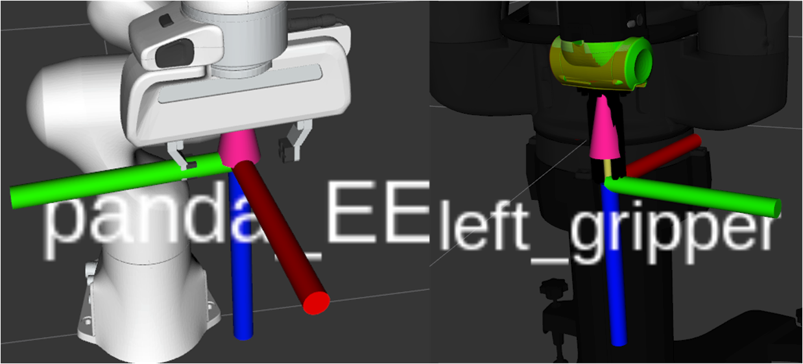

每个型号的gripper frame都与其具体的物理夹爪相对应。


## 抓取典范坐标系 Grasp canonical frame

思考，思考实际执行抓取时候，机械臂将会驱动夹爪坐标系$G'$到达指定的（相对于基座坐标系）位置姿态来到达指定的位姿来执行抓取，然而，不同型号夹爪惯用的夹爪坐标系$G'$固连方式不同，如何保证算法计算出的结果可以正确地应用于不同型号的夹爪上呢？

Dex-net 通过设定一个虚拟夹爪，并在其上固定一个虚拟的典范（标准）坐标系作为中介，并且在计算过程中，算法统一使用该典范抓取坐标系来计算和表示抓取的位置姿态（相对于mesh坐标系或者相对于相机坐标系）；

最终，使用不同的夹爪执行抓取时，只需要根据具体的机器人夹爪，给定夹爪坐标系到典范抓取坐标系的变换矩阵$^{G'}T_G$，就可以将算法计算的抓取姿态转换为夹爪姿态；

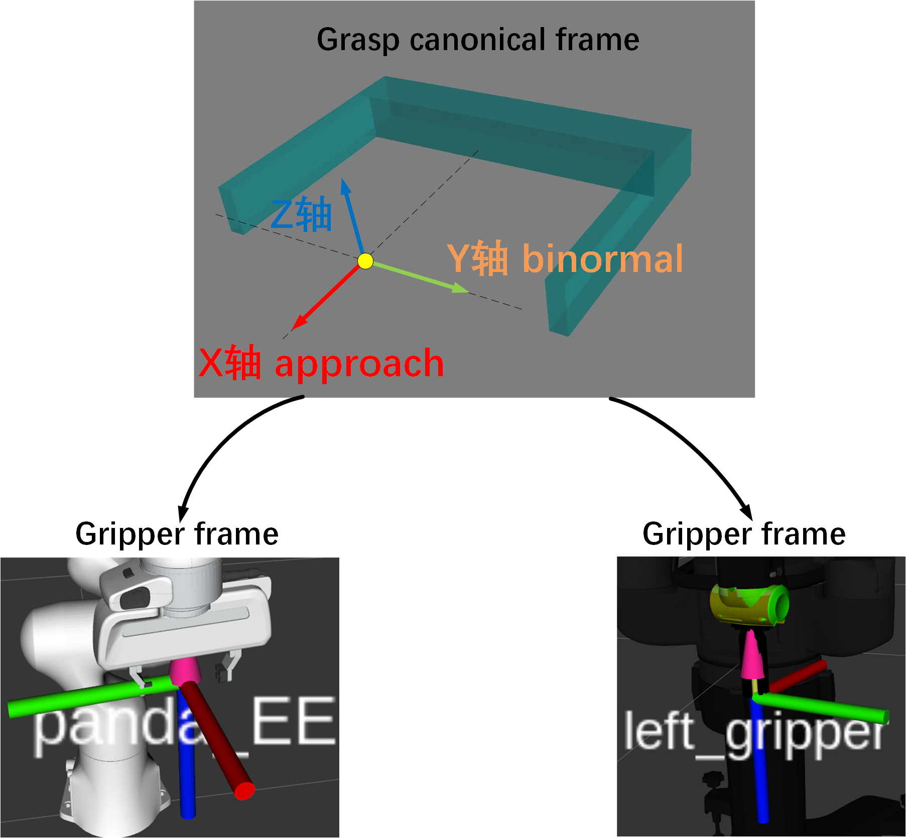

这种典范坐标系，就称为**抓取典范坐标系grasp canonical frame**, 其实也可以理解为**典范夹爪坐标系**（选定了一个标准规范的夹爪，试用其夹爪坐标系作为中介）；后文简记为grasp frame。

### 抓取典范坐标系的基本设定与抓取的表示

Dex-net设定的抓取典范坐标系定义满足右手定则，保证了典范坐标系的基本形式是确定的。

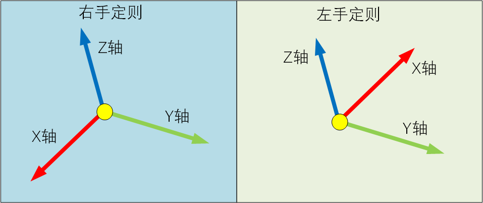

之后，Dex-net将典范坐标系固连在虚拟夹爪上，为每个轴分配具体的含义。具体固连方式如下图，认为原点处于两个夹爪指尖的连线中心点位置，夹爪坐标系x轴指向夹爪外部(接近轴)，y轴就是两个夹爪合并的方向，z轴与这两个方向正交；设定z轴的指向为虚拟夹爪的前方，虚拟夹爪也是有正反的，这样才能唯一确定夹爪与典范抓取坐标系的固连方式。

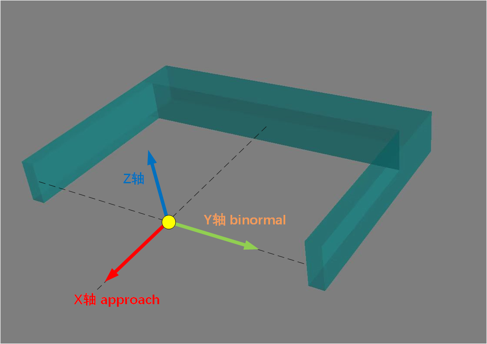

其中，典范抓取坐标系各个轴的名称为

- x轴    称为approach axis    接近轴
- y轴    称为  binormal  axis  或者  grasp axis  或者major_pc
- z轴    称为   minor_pc   


**注意**：这里只是确定了典范抓取坐标系的形式，以及与虚拟夹爪的固连方式；但是典范坐标系在世界参考坐标系中的具体位置姿态还是没有确定的。


### 抓取姿态的表示(7维度抓取向量)

在抓取采样时，一个具体的抓取姿态，可以使用典范抓取坐标系G与mesh坐标系M的相对变换关系$^{M}T_G$ 来确定，Dex-net使用了一个7维度的向量$g=(p,axis,\theta)\in \mathbb{R}^7$来表示这个变换关系，其中$p=(x,y,z)\in \mathbb{R}^3$为坐标系原点， $axis=(axis_x,axis_y,axis_z)\in \mathbb{R}^3$代表典范坐标系y轴的单位向量， $\theta\in [-\pi,\pi]$ 为典范坐标系绕G-Y轴的旋转量（具体旋转起点）。

包括抓取采样算法获得的候选抓取姿态，都是使用的$g=(p,axis,\theta)\in \mathbb{R}^7$来进行的表示，以下是抓取采样器输出的抓取向量，Dex-net除了输出位置姿态外，还输出了一些夹爪张开宽度等参数，拓展成为10维度向量，代表一个完整的抓取配置`Grasp configuration`：

```python
    def configuration_from_params(center, axis, width, angle=0, jaw_width=0, min_width=0):
        """ Converts grasp parameters to a configuration vector. 
        """
        if np.abs(np.linalg.norm(axis) - 1.0) > 1e-5:
            raise ValueError('Illegal grasp axis. Must be norm one')
        #首先创建一个1行10列的行向量
        configuration = np.zeros(10)
        #前3个数字是，夹爪指尖连线中心点坐标，表示夹爪的位置
        configuration[0:3] = center
        #3~5是抓取的闭合轴G-Y
        configuration[3:6] = axis
        #猜测是计算出的夹爪张开宽度，没搞明白
        configuration[6] = width
        #绕G-Y轴旋转的角度
        configuration[7] = angle
        #没搞明白
        configuration[8] = jaw_width
        #该型号夹爪最小的闭合宽度
        configuration[9] = min_width
        return configuration

```


### 使用抓取向量确定抓取典范坐标系位置与姿态

思考，如何从这个7维度的向量$g=(p,axis,\theta)\in \mathbb{R}^7$来唯一确定的典范坐标系姿态$^{M}T_G$ ？即到底是如何确定抓取坐标系三个坐标轴G-X,G-Y,G-Z在模型参考系中的单位向量呢？

考虑如下的情况（即仅考虑旋转）,假设抓取坐标系G-Y轴向量与模型参考系M-Y重合时，即$\vec{axis}=(0,1,0)$ 时

1. 选取向量$\vec{approach'}=(axis_y,-axis_x,0)=(1,0,0)$ 作为临时approach轴，此时该向量与G-Y轴垂直，且满足G-Z坐标值为0，即与M:X-O-Y平面平行

2. 将$\vec{approach'}$绕G-Y轴旋转$\alpha$角，得到抓取坐标系的approach向量（G-X轴）

3. 使用符合右手螺旋定律的叉乘，找到G-Z轴

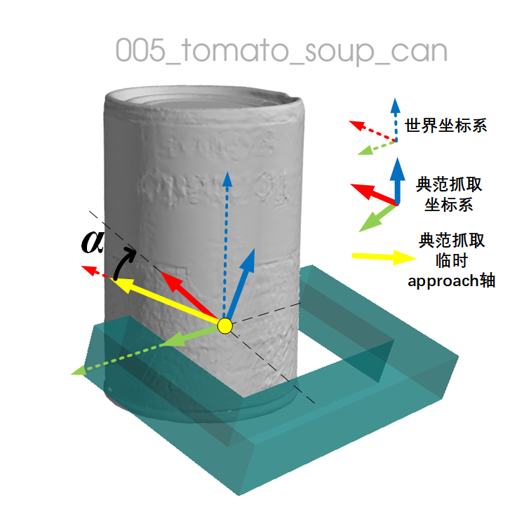


具体的，参考系为世界坐标系记为W，抓取坐标系记为G

- G-Y轴方向确定的方式是，在采样过程中，先在物体上随机抽点，作为接触点`c1` ，之后在指定的摩擦锥范围内做射线，穿透待抓取物体，在另一侧找到射线与物体的接触点`c2`，则以向量$\vec{c_1c_2}$  作为抓取射线，其单位向量就作为G-Y轴

    ```python
        #dex-net/grasping/grasp.py
        @staticmethod
        def axis_from_endpoints(g1, g2):
            """ Normalized axis of grasp from endpoints as np 3-arrays """
            grasp_axis = g2 - g1
            if np.linalg.norm(grasp_axis) == 0:
                return grasp_axis
            return grasp_axis / np.linalg.norm(grasp_axis)
    ```

- G-X轴具体的确定方法是，先设定一个与G-Y轴垂直，且与W: X-O-Y平面（即世界坐标系X-O-Y平面平行）的单位向量作为G-X轴的初始方向，之后，绕着G-Y轴（满足右手螺旋定律）正方向旋转$\alpha$角，得到正确的G-X轴。

    ```python
        #设定一个与y轴垂直且与世界坐标系x-o-y平面平行的单位向量作为初始x轴
        axis_x = np.array([axis_y[1], -axis_y[0], 0])  #该向量z轴值为0，说明该向量与参考系的x-o-y平面平行
        if np.linalg.norm(axis_x) == 0:
            axis_x = np.array([1, 0, 0])
        #单位化
        axis_x = axis_x / np.linalg.norm(axis_x)
        #这个R2就是一个临时的抓取坐标系，但是它的姿态还不代表真正的抓取姿态
        R2 = np.c_[axis_x, np.c_[axis_y, axis_z]]
        #将现有的坐标系利用angle进行旋转，就得到了真正的夹爪坐标系，
        # 抽出x轴作为抓取坐标系approach轴，由于是相对于运动坐标系的旋转，因此需要右乘
        approach_normal = R2.dot(R1)[:, 0]
        approach_normal = approach_normal / np.linalg.norm(approach_normal)
    
    ```
    
    思考：`与G-Y轴垂直，且与世界坐标系X-O-Y平面平行的单位向量`有两个，它们方向相反，分别是$(-GY_y,GY_x,0)$与$(GY_y,-GY_x,0)$ ，dex-net人为选定了第二种作为G-X轴初始方向，并以此为基准，以右手螺旋定则，求解出旋转角度$\alpha $ 
    
- G-Z轴的确定是，以右手法则为标准，从G-X旋向G-Y轴，以此获得G-Z方向

```python
    #右手定则，从x->y  
    minor_pc = np.cross( approach_normal,major_pc)
```


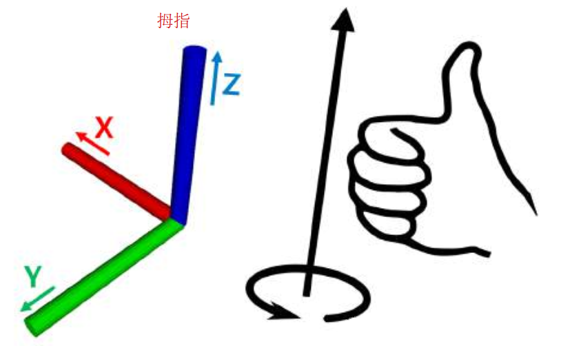


## 夹爪坐标系与抓取典范坐标系之间的变换设定

不同型号夹爪可能具有不同的惯用夹爪坐标系，可以通过创建修改不同夹爪文件夹路径下的`T_grasp_gripper.tf`文件来设定抓取典范坐标系与夹爪坐标系之间的变换关系。

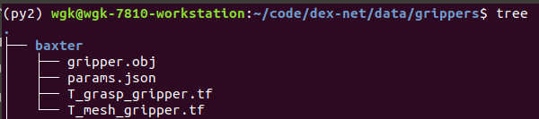

其中：

- `gripper.obj`  真实夹爪的物体mesh模型
- `params.json`   量取真实的夹爪尺寸，用来对虚拟典范夹爪的尺寸进行设定，用来碰撞检测等操作
- `T_grasp_gripper.tf`  设定 gripper坐标系 to grasp坐标系的变换（gripper坐标系在抓取规范坐标系中的表示）
- `T_mesh_gripper.tf`  设定gripper坐标系 to mesh模型坐标系的变换（gripper坐标系在mesh坐标系中的表示）该变换主要用于图像渲染，不参与计算

打开baxter夹爪的`T_grasp_gripper.tf`内容格式如下

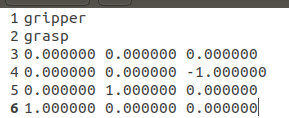

该文件可以使用`autolab_core`库标准，

```python
   from autolab_core import RigidTransform
    #使用RigidTransform.load()可以直接读取
   T_grasp_gripper = RigidTransform.load(os.path.join(gripper_dir, gripper_name, T_GRASP_GRIPPER_FILENAME)) 
	###########################
    #关于该T_GRASP_GRIPPER_FILE的内容定义
    def load(filename):
        """Load a RigidTransform from a file.
        The file format is:
        from_frame    				                               第1行指定父坐标系
        to_frame		 					                           第2行指定子坐标系
        translation (space separated)              第3行是平移变换
        rotation_row_0 (space separated)     第4~6行构成了标准旋转矩阵（不是转置，就是标准旋转矩阵）
        rotation_row_1 (space separated)
        rotation_row_2 (space separated)

```

旋转矩阵的每一列分别代表子坐标系$x,y,z$轴单位向量在父坐标系中的表示，那么

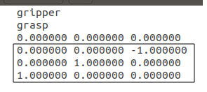

旋转矩阵第一列表示(子)抓取典范坐标系x轴 在gripper坐标系(父)中的向量为$(0,0,1)$ 即与gripper坐标系z轴相同

选抓矩阵第二列表示(子)抓取典范坐标系y轴 在gripper坐标系(父)中的向量为$(0,1,0)$ 即与gripper坐标系y轴相同

选抓矩阵第三列表示(子)抓取典范坐标系z轴 在gripper坐标系(父)中的向量为$(-1,0,0)$ 即与gripper坐标系x轴相反

对比查看两个夹爪的示意图，验证了上述分析

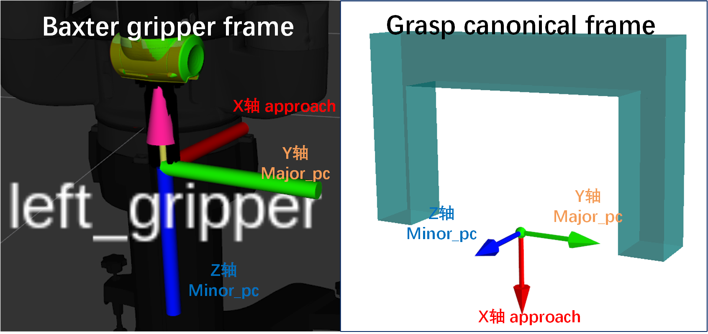


## Dex-net直接输出针对某特定夹爪的位置姿态（相对于mesh参考坐标系）

dex-net采样得到的初步抓取姿态是典范抓取坐标系姿态，在实现上，是将一个抓取包裹成一个`dexnet.grasping.ParallelJawPtGrasp3D`类对象实例返回，

通过`dexnet.grasping.ParallelJawPtGrasp3D.configure`函数获取10维度的抓取配置向量；

另外可以使用`dexnet.grasping.ParallelJawPtGrasp3D.gripper_pose( gripper=None)`函数来直接返回指定型号夹爪的夹爪坐标系与物体mesh坐标系之间的变换

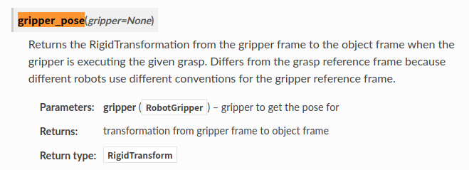

