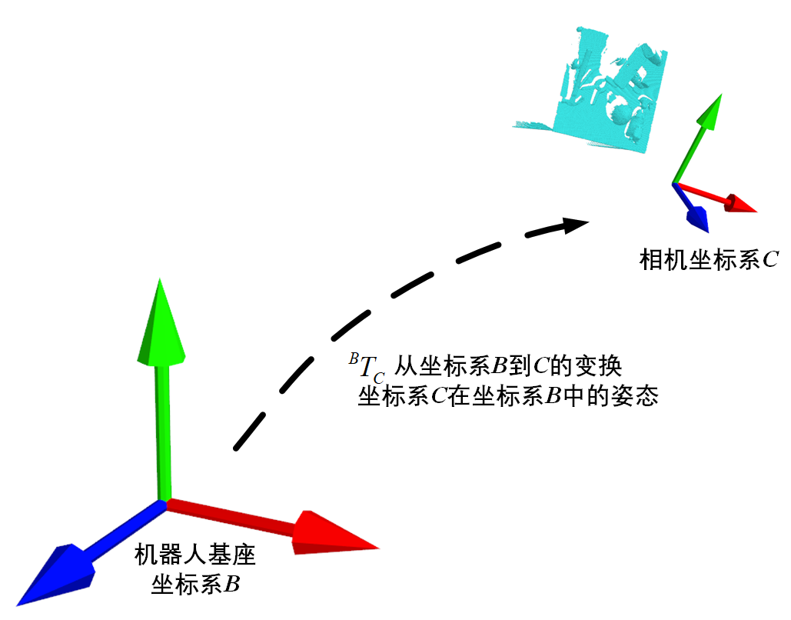

# 刚体、变换、位姿、坐标系

## 变换与位姿

变换和位姿都是坐标系之间的关系，因此说变换说位姿一定要记得带上坐标系；变换和位姿在本质上是说的一样东西，但是在说法上又有所不同，比如：



**相机坐标系相对于机器人基座坐标系的位姿，就等同于，从机器人基座坐标系到相机坐标系的变换；**

>  注意上面句子的句式，规定一个良好的句式有利于以后对坐标变换系统的理解。

换句话说，相机坐标系相对于机器人基座坐标系的位姿矩阵，含义和数值上都等同于，(from `parent/souce frame`  to `child/target frame` )从机器人基座坐标系(父/源坐标系)到相机坐标系(子/目标坐标系)的变换矩阵$^{B}T_C$；

这里说的变换主要是名词含义，指代的是坐标系之间的转换（名），数学上指的是标准齐次$4\times4$变换矩阵：
$$
^{B}T_C= \begin{bmatrix}n_x&o_x&a_x&t_x\\n_y&o_y&a_y&t_y\\n_z&o_z&a_z&t_z\\0&0&0&1\\\end{bmatrix}=\begin{bmatrix}R&\vec{t}\\0&1 \end{bmatrix}
$$
其中，旋转子矩阵$R$的三个列向量$\vec{n}$、$\vec{o}$、$\vec{a}$就是相机坐标系$n,o,a$轴在机器人基座坐标系中的单位向量，平移向量$\vec{t}=[t_x,t_y,t_z]^T$ 是相机坐标系原点在机器人坐标系中的位置坐标。
$$
R=\begin{bmatrix} n_x&o_x&a_x \\ n_y&o_y&a_y\\n_z&o_z&a_z\end{bmatrix}
$$
当变换只有旋转没有平移时，相当于变换矩阵$T$退化为$3\times3$旋转矩阵$R$ 。

后文也有地方提到"把坐标系A变换到坐标系B"，这里的`变换`更多是动词含义，指代实际动作，结合具体情况理解。


刚体和坐标系的关系类似于雪糕（点云）与雪糕棍（相机坐标系或者叫点云自身固连的坐标系）；雪糕棍是固连在雪糕上的，我们只需要知道雪糕棍子在哪里，就能知道雪糕在哪里；


说变换，就都要带上坐标系，反之，坐标系之间的关系，都是说的变换

有时候，我们只是想知道父子坐标系之间的变换就行，比如：

- 执行抓取时，我们只需要知道检测出的抓取(坐标系)$G$相对于机器人基座坐标系$B$的位姿$^{B}T_G$，即基座坐标系到抓取坐标系之间的变换就可以将夹爪伸到抓取位姿执行抓取；（此时假设典范抓取坐标系$G$和夹爪坐标系$G'$的配置方式是一致的，即无需进行旋转，见dex-net具体文档）

  **图**

- 机器人手眼标定，我们需要的相机坐标系$C$ 相对于机器人基座坐标系$B$的位姿$^{B}T_C$。

  **图**

但是有时候，我们需要的不仅是变换，还需要知道子坐标系所固连的刚体上每个点相对于父坐标系下的位置坐标，比如：

- 抓取过程中，我们假设想把虚拟夹爪显示出来，就需要知道虚拟夹爪上的每个点$p$在参考系（此时参考系是机器人基座坐标系）中的坐标$^{B}p$；此时有
  $$
  ^{B}p = ^{B}T_G\times ^{G}p
  $$
  其中，$^{G}p$是虚拟夹爪上每个点相对于夹爪参考系的坐标，由于是固连的，因此它是已知的。

  **图**

- 机器人手眼标定后，希望将深度相机采集到的点云以机器人坐标系为参考系显示出来，就需要知道固连在相机坐标系下的点云中的每个点$p$在机器人基座坐标系中的坐标$^{B}p$，此时有
  $$
  ^{B}p = ^{B}T_C\times ^{C}p
  $$
  其中$^{C}p$是点云各点相对于相机坐标系的位置坐标，深度相机通过内参标定之后，该点云值就是准确可知的。

  **图**


因此，面向任务，要先想清楚，**我们的任务到底是什么？要的是坐标系之间的变换，还是想要刚体上每个点相对于新参考系的位置？**

**求变换，和求刚体点位置是两码事**

在具体编程时，我们只需要把想要的目标数据放在等号左侧，把计算所需要的数据放在等号右侧，然后去找全等号右侧的数据就可以进行计算了。


## 任务举例

### 任务说明

希望将使用dex-net中的Antipodal采样器采集到的抓取（相对于mesh坐标系）与点云相互配准，并使用mayavi显示出来点云和夹爪，

**图**

### 描述符号

首先应该列举出任务中存在和需要的刚体以及它们固连的坐标系系统，并用符号进行描述。

任务中存在如下刚体：

- 点云 ，上面的点记为$p$
- mesh模型   上面的点记为$m$
- 虚拟夹爪     上面的点记为$g$

存在如下坐标系系统

- 相机坐标系     $C$   固连在点云上

- 仿真世界坐标系    $W$

- mesh坐标系   $M$      固连在mesh模型上

- 夹爪典范坐标系  $G $   固连在虚拟夹爪上

  

### 问题定义

求出抓取坐标系$G$相对于点云坐标系（相机坐标系）$C$的位姿，得到变换$^{C}T_G$，并求出虚拟夹爪上各点$g$相对于相机坐标系的位置坐标$^{C}g$

**图**


### 具体计算步骤

1. 写出需要的目标与计算公式

$$
^{C}p=  ^{C}T_G\times^{G}p
$$


​	所以，应该做的事情是，**求变换，就单独求变换，求完之后，再求各个点的位置**。

2. 摆出现有已知的坐标系变换

   由于实际上求$ ^{C}T_G$涉及到多个坐标系进行链式变换，因此需要对该连是变换序列进行推导，首先可以先排列出当前已知的变换：

   - 相机坐标系$C$相对于仿真世界坐标系$W$中的位置姿态，即世界坐标系到相机坐标系的变换$^{W}T_C$

   - 模型坐标系$M$相对于仿真世界坐标系$W$中的位置姿态，即世界坐标系到模型坐标系的变换$^{W}T_M$

   - 夹爪坐标系$G$相对于mesh坐标系$M$的位置姿态，即mesh坐标系到夹爪坐标系的变换$^{M}T_G$

     

3. 推导链式变换序列

   需要的变换$^{C}T_G$的变换序列是:

$$
^{C}T_G =^{C}T_W\times^{W}T_M\times^{M}T_G={^{W}T_C}^{-1}\times^{W}T_M\times^{M}T_G
$$


4. 进行点坐标计算
   $$
   ^{C}p=  ^{C}T_G\times^{G}p={^{W}T_C}^{-1}\times^{W}T_M\times^{M}T_G\times^{G}p
   $$


#### 	注意点

1. 点坐标补位
   $$
   ^{C}p=  ^{C}T_G\times^{G}p
   $$
   上述公式中的变换矩阵$^{C}T_G$默认包含了旋转与平移两部分，是标准齐次$4\times4$变换矩阵，点坐标$^{G}p$默认也是4维的齐次坐标向量（三维坐标后补1）。
   
   当变换只有旋转没有平移时，相当于变换矩阵$^{C}T_G$退化为$3\times3$旋转矩阵$R$ ，此时$^{G}p$直接相乘就好，不需要齐次。

2. 变换矩阵求逆

   对于标准齐次$4\times4$变换矩阵$T$而言，它的求逆运算比较麻烦，通常将变换矩阵拆分为标准$3\times3$旋转矩阵$R$以及平移向量 $\vec{t}$ 两部分来计算：
   $$
   T = \begin{bmatrix}n_x&o_x&a_x&t_x\\n_y&o_y&a_y&t_y\\n_z&o_z&a_z&t_z\\0&0&0&1\\\end{bmatrix}=\begin{bmatrix}R&\vec{t}\\0&1 \end{bmatrix}
   $$
   

   标准$3\times3$旋转矩阵$R$是酉矩阵，它的逆运算等于它的简单转置，即，$R^{-1}=R^T$；平移部分则是向量$\vec{t}$分别与向量$\vec{n},\vec{o},\vec{a}$点积的负值
   $$
   T^{-1} = \begin{bmatrix}n_x&n_y&n_z&-\vec{n}\cdot\vec{t}\\o_x&o_y&o_z&-\vec{o}\cdot\vec{t}\\a_z&a_z&a_z&-\vec{a}\cdot\vec{t}\\0&0&0&1\\\end{bmatrix}=\begin{bmatrix}R^T&-R\cdot\vec{t}\\0&1 \end{bmatrix}
   $$
   

   这样做对于计算变换矩阵的逆是很有帮助的，而直接对矩阵$T$整体进行逆运算是一个很冗长的过程。

   在实际的计算过程中，往往就是用这种方式，比如`autolab_core`中的`rigid_transformations.RigidTransform.inverse`函数

   ```python
       def inverse(self):
           """Take the inverse of the rigid transform.
   
           Returns
           -------
           :obj:`RigidTransform`
               The inverse of this RigidTransform.
           """
           inv_rotation = self.rotation.T  #旋转矩阵的逆
           inv_translation = np.dot(-self.rotation.T, self.translation) #平移向量的逆
           return RigidTransform(inv_rotation, inv_translation,
                                 from_frame=self._to_frame,
                                 to_frame=self._from_frame)
   ```

   

### 编程实现

对于公式
$$
^{C}p=  ^{C}T_G\times^{G}p={^{W}T_C}^{-1}\times^{W}T_M\times^{M}T_G\times^{G}p
$$


1. 获取变换${^{W}T_C}^{-1}$

    ```python
    from autolab_core import RigidTransform
    #WTC
    world_to_scaner = np.load(world_to_scaner_path_list[scene_index])
    world_to_scaner_quaternion = world_to_scaner[3:7]#四元数
    world_to_scaner_rot = RigidTransform.rotation_from_quaternion(world_to_scaner_quaternion)#转换到旋转矩阵
    world_to_scaner_trans =world_to_scaner[0:3]#平移向量
    world_to_scaner_T =  RigidTransform(world_to_scaner_rot,world_to_scaner_trans) #构造WTC刚体变换对象
    #CTW
    scaner_to_world_T = world_to_scaner_T.inverse().matrix #得到逆矩阵
    ```

2. 获取变换$^{W}T_M$

   ```python
    #获取WTM
    world_to_mesh_7d = table_mesh_poses_array[mesh_index]
   world_to_mesh_rot = RigidTransform.rotation_from_quaternion(world_to_mesh_7d[3:])
   world_to_mesh_trans = world_to_mesh_7d[0:3]
   world_to_mesh_T = RigidTransform(world_to_mesh_rot,world_to_mesh_trans).matrix
   ```

3. 获取变换$^{M}T_G$

   ```python
   #MTG 列表，由于autolab_core.RigidTransform不支持多维度批量的变换，所以这里自己写
   mesh_to_grasps_rot=get_rot_mat(grasps_with_score) #mesh_to_grasps_rot.shape = (30,3,3)
   mesh_to_grasps_trans =  grasps_with_score[:,0:3]   #mesh_to_grasps_trans.shape=(30,3)
   mesh_to_grasps_rot_trans = np.concatenate((mesh_to_grasps_rot,mesh_to_grasps_trans.reshape(-1,3,1)),axis=2) #shape=(30,3,4)
   temp = np.array([0,0,0,1]).reshape(1,1,4).repeat(mesh_to_grasps_rot.shape[0],axis=0) #补第四行
   mesh_to_grasps_T =np.concatenate((mesh_to_grasps_rot_trans,temp),axis=1) #再拼成标准4X4 ,   shape=(30,4,4)
   ```

4. 计算总变换$^{C}T_G $   就是抓取坐标系相对于相机坐标系下的位置姿态

   ```python
   #计算CTG  
   scaner_to_grasps_T =np.matmul(np.matmul(scaner_to_world_T,world_to_mesh_T),mesh_to_grasps_T)  #计算4x4变换矩阵
   ```
   
5. 计算点坐标$^{C}p$（在本任务中就是计算虚拟夹爪上的点，用于显示和碰撞检测等操作）

   计算点坐标$^{C}p$有两种方式：

   - 计算变换时，以整体形式计算，得到最终的$4\times4$齐次变换矩阵之后，再将其分解，抽出$3\times3$变换矩阵$R$和平移向量$\vec{t}$，与点$p$ 向量**先旋转再平移(相加)，顺序不能相反**，此时$^{C}p$为三维坐标
   
   $$
   ^{C}p=R\cdot ^{G}p+\vec{t}
   $$
   
   - 将三维度点坐标$^{G}p$拓展为四维齐次坐标向量，然后直接使用$4\times4$齐次变换矩阵进行变换，得到的也是齐次的4维坐标向量
     $$
     ^{C}p=  ^{C}T_G\times^{G}p
     $$
   
   ```python
   scaner_to_grasp_T=scaner_to_grasps_T[0]
   scaner_to_grasp_rot = scaner_to_grasp_T[0:3,0:3]
   scaner_to_grasp_trans = scaner_to_grasp_T[0:3,3].reshape(-1,3)
   
   Gp = np.array([1,2,3]) #随便设置一个点Gp
   Gp_q = np.array([1,2,3,1])#将Gp拓展为齐次坐标向量Gp_q
   
   #分解为R t 两个变换步骤，使用非齐次点Gp
   Cp_r_t=scaner_to_grasp_rot.dot(Gp) + scaner_to_grasp_trans#先旋转再平移
   Cp_t_r=scaner_to_grasp_rot.dot(Gp+ scaner_to_grasp_trans)#先平移再旋转
   
   #直接使用4x4变换矩阵计算,使用齐次点Gp_q，得到齐次坐标点Cp_q
   Cp_q = scaner_to_grasp_T.dot(Gp_q)
   
   print(Cp_r_t)
   >>>[-1.58108308  3.49795968 -0.32400429]   #正确，先旋转再平移
   print(Cp_t_r)
   >>>[-0.62973867  2.98622214  0.68276591]    #说明顺序是错的
   print(Cp_q[0:3])
   >>>[-1.58108308  3.49795968 -0.32400429]    #正确
   ```
   
   


